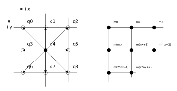
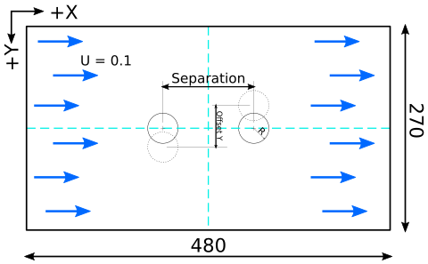
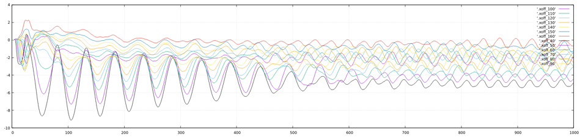
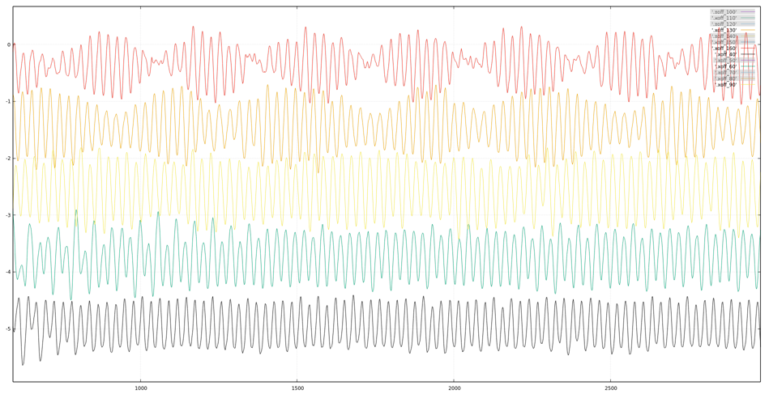
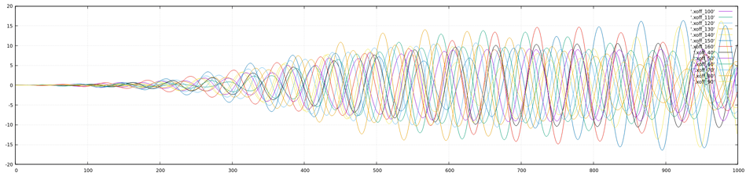
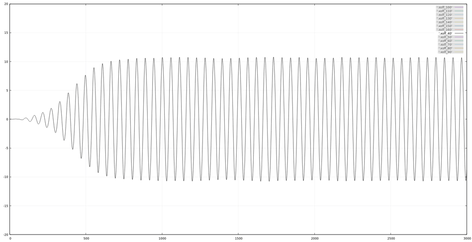
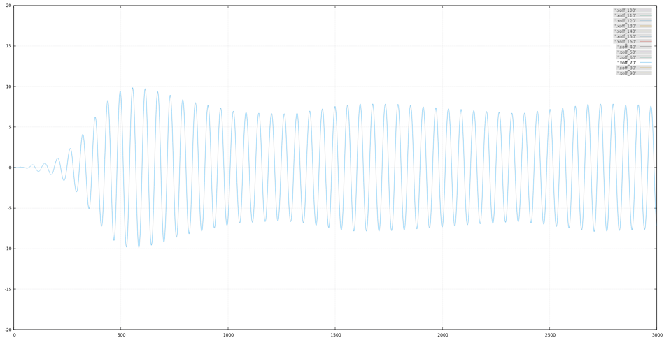
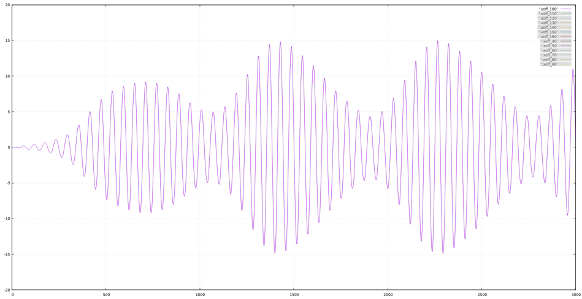
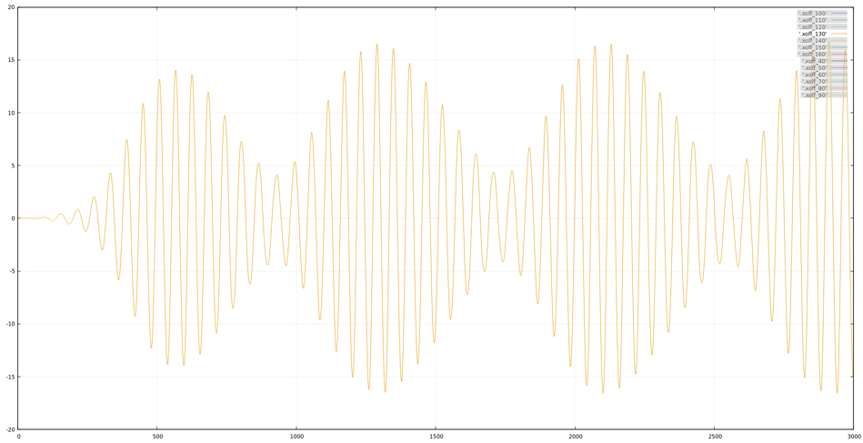

# LBM Simulator - Cylindrical Moving Boundary


[](https://github.com/protozis/LBM_CYMB)
[](https://protozis.com:3000/Jerry/LBM_CYMB)

Before you start using this simulator, it is highly recommended to read the instruction I made: **[What's the physics of this LBM simulation?](physics.md)**.

## Table of contents
1. [Dependences and Build process](#dependences-and-build-process)
2. [Start a Simulation Step by Step](#start-a-simulation-step-by-step)
3. [Design and Analyze an Experiment](#design-and-analyze-an-experiment)

## Dependences and Build process
### C Binaries
Most C programs are written in `C99` standard, therefore no extra libs needed. However, since some of the environment setups would be nasty for `clang` when you are compiling OpenCL kernel program, I will recommend you to use `glibc` instead. As for the The OpenCL driver, it really dependent on the platform you have. You should check your OS instruction manual for the driver packages you need to install. In Archlinux they are:

**Runtime**
- Intel GPU: `intel-compute-runtime`
- Intel CPU: `intel-opencl-runtime<sup>AUR</sup>`
- Nvidia GPU: `opencl-nvidia`
- AMD GPU: `opencl-mesa`
- AND CPU: Not supported anymore.(?)

**Development**
- ICD loader: `ocl-icd`
- Headers: `opencl-headers`

**Tools**
- `clinfo`: good for monitoring all possible platform properties of the system.

You can build and install the binaries with: 
```shell
$> cd LBM_CYMB/src
$> make
$> make install
```
`make install` will copy all binaries and `.cl` kernel source file into `LBM_CYMB/bin`. Clean all binaries with `make clean` if you want a fresh make.

Be advice that the Opencl target version need to be defined in you host program as 
```C
#define CL_TARGET_OPENCL_VERSION 300
```
while `300` stands for the version `3.0.0`. Also the atomic function support for 64-bits integer is required by the force calculation in `simulate_ocl.cl`, you will need to check if the device extension of `cl_khr_int64_atomics` is available for your desire platform.

> [Note] If you want to make MP4 video in pipeline, `ffmpeg` must be installed. 

### Scripts
These dependences are only used by shell script.
- `time`: Linux built-in one, GNU version also works.
- `gnuplot`: Used by `plot.p` for visualize data.

## Start a Simulation Step by Step
Following steps can be altered by your own needs, feel free to play around with it.

### Choose a Resolution
To decide a good resolution for the simulation, you should consider with:
1. **The fluid phenomenon you are studying at.** 

	The higher the resolution is, the more accurate simulation you get. However there dose not have a good calculation to tell you what resolution is enough for you, the only approach is benchmarking.

2. **The device you are using.**

	All devices will have their own `preferred work group size multiple` affected by the number of compute units and the size of cache. Check the value with `clinfo`. Most of the case, Intel CPU will go for `128` multiple, while GPU will go for `32` multiple. A simple approach is following the screen resolution, since it is how GPU is designed for. However it may not always be the best one for sure.

For example this is an experiment in 1920x1080 resolutions, i.e. 1080p.

[3cir](img/3cir_1920x1080.mp4)

### Make an Experiment Setup
Inside an experiment setup directory we have:
```
example/
├── a.bc
├── a.nd
├── a.pd
├── data
│   ├── 0.mp4
│   ├── 1.mp4
│   └── 2.mp4
├── debug
├── default.conf
├── log
└── plot.p
```

To perform an experiment, you will need to tweak these files:
|Name|Description|
|-|-|
|a.bc|Boundary condition file|
|a.nd|Number Density file|
|a.pd|Platform/Device file|
|default.conf|Main configuration file|

And following files are used to collect and analyze data.
|Name|Description|
|-|-|
|debug|Used to collect desire parameters|
|data|Result videos or ND files|
|log|Running conditions and status|
|plot.p|gnuplot script|


#### ND (Number Density) file
Number density matrix describe particle densities in different velocities and positions. For an D2Q9 ND file with 480x270 in size, is formatted as
```
480 270 9
[m0q0] [m0q1] [m0q2] ...
[m1q0] [m1q1] [m1q2] ...
[m2q0] [m2q1] [m2q2] ...
...
```


Use `nd_gen` to make an initial ND file with following options:
```
Usage: nd_gen [OPTION]
Otions:
	-x #, Numer of column
	-y #, Number of row
	-d #, Density (Default: 0.3)
	-i #, Ux (Default: 0.12)
	-j #, Uy (Default: 0)
	-h , Print this help page
Example:
	nd_gen -x 100 -y 30 -d 0.3 -i 0.1 -j 0 > exp_sets/example/a.nd

```  

#### BC (Boundary Condition) file
Boundary condition include following classes:
1. BCV: Unified fluid that surround the simulation area.
2. CY: Cylinder object.

For example:
```
bc_no 2
bc_nq 2
BCV {
	dnt 1
	ux 0.0
	uy 0.0
}
CY {
	spring 0.1
	damp 0
	mass 1000
	rad 20
	force 0 0
	acc 0 0
	vel 0 0
	dsp 10 0
	pos 250 70
}
CY {
	spring 0.1
	damp 0
	mass 1000
	rad 20
	force 0 0
	acc 0 0
	vel 0 0
	dsp 10 0
	pos 250 150
}
```
|Parameter|Description|
|-|-|
|bc_no|Number of objects|
|bc_nq|Kinematic dimension of objects, usually 2 in 2D simulation.|
|dnt|Density|
|ux|Macro velocity in x axis|
|uy|Macro velocity in y axis|
|spring|Spring constant of the cylinder, in lattice unit|
|force|Initial value of applied force of the cylinder, in lattice unit|
|damp|Damping constant of the cylinder, in lattice unit|
|mass|Mass of the cylinder, in lattice unit|
|rad|Radius of the cylinder, in lattice unit|
|force|Initial value of applied force of the cylinder, in lattice unit|
|acc|Initial value of applied force of the cylinder, in lattice unit|
|vel|Initial value of velocities of the cylinder, in lattice unit|
|dsp|Initial value of displacements of the cylinder, in lattice unit|
|pos|Initial value of positions of the cylinder, in lattice unit|

#### PD (Platform/Device) file

- **Platform & Device**
	
	A platform is an specific OpenCL implementation, e.g. Intel, AMD or Nvida CUDA. A device is the actual processor that perform the calculation, like `Intel(R) Core(TM) i7-8565U CPU @ 1.80GHz`, `NVIDIA GeForce MX150`.

- **Work-group & Work-item** 

	A work-group is processed by a single compute unit in the device. For a CPU device it prefer a larger work-group size, while a GPU works opposite. The amount of work-item in a work-group has its limitation, check *Max work group size* for the value. For multi-dimension work-group, the total amount of work-item cannot exceed *Max work group size* too, and the work-item in each dimension will have their own limitation. Check *Max work item sizes* for the value.

Use the script `speed_test` to choose the best environment setup. If the chosen work-group exceed the max allowed work-group size for the device, the result will not be printed. Example: 

```shell
$> clinfo -l
Platform #0: Intel(R) OpenCL HD Graphics
 `-- Device #0: Intel(R) UHD Graphics 620 [0x3ea0]
Platform #1: Intel(R) OpenCL
 `-- Device #0: Intel(R) Core(TM) i7-8565U CPU @ 1.80GHz
Platform #2: NVIDIA CUDA
 `-- Device #0: NVIDIA GeForce MX150
$> ./speed_test exp_sets/example
#Syntax: pdFileName[platform device localSize1 localSize2] realTime(secs)
#
Working on...completed!
p2d0_120.pd[2/0/16/9]                             	7.90
p0d0_120.pd[0/0/16/9]                             	8.11
p1d0_24.pd[1/0/80/45]                             	8.28
p1d0_40.pd[1/0/48/27]                             	8.43
p1d0_60.pd[1/0/32/18]                             	8.52
p1d0_120.pd[1/0/16/9]                             	8.55
p1d0_20.pd[1/0/96/54]                             	8.60
p1d0_30.pd[1/0/64/36]                             	8.70
p2d0_60.pd[2/0/32/18]                             	8.75
```
You can see that Nvidia GPU with 16x9 work-group size is the fastest one. Write the result to your experiment setup with:
```
$> cp pd_auto/p2d0_120.pd exp_sets/example/a.pd
``` 

#### .conf file
Following parameters are included in a configuration file:
|Parameter|Description|Default|
|-|-|-|
|LOOP|Iteration of `SKP`.|1|
|SKP|Iteration of fluid propagate by time step.|1|
|CF|Collision frequency in Lattice unit|1|
|CS|Speed of sound in SI unit.|340|
|CL|Dimensional value of length|1|
|CD|Dimensional value of Density|1|
|MA|Mach number(Dimensionless)|0.1|
|IS_MP4|Make mp4 videos or not.|0|
|IS_SAVE_DATA|Save final ND matrix or not.|0|
|IS_FILE_OUTPUT|Save ND matrix for every loops or not.|0|
|ND_FILE|ND filename|NULL|
|BC_FILE|BC filename|NULL|
|PD_FILE|PD filename|NULL|
|OUTPUT_DIR|Output filename|NULL|
|PROGRAM_FILE|OpenCL source filename|NULL|
|REFUEL_RTO|Refuel ratio|0.8|
|EAT_RTO|Eat ratio|0.01|
|LOG_FILE|Log filename|NULL|
|DEBUG_FILE|Debug filename|NULL|
|IS_LOG_PRINT|Print log to stdout or not.|1|
|IS_PROGRESS_PRINT|Print progress or not|1|
|PL_MAX_D|Maximum density value for the jetcolormap ploting|0.5|
|PL_MAX_UX|Maximum x velocity value for the jetcolormap ploting|0.1|
|PL_MAX_DUY|Maximum y velocity value for the jetcolormap ploting|0.1|

### Perform an experiment
Run `simulator` with desire experiment setup:
```shell
$> ./simulator exp_sets/1920x1080
``` 
If multiple experiments are going to be launched at once, use `schedule` plus a plain text list file of experiment setups directory name, like:
```shell
$> cat exp_grp1
exp_sets/480x270_skp10
exp_sets/480x270_skp20
exp_sets/480x270_skp30
exp_sets/480x270_skp40
exp_sets/480x270_skp50
```
And launch with:
```shell
$> ./schedule exp_grp1
```

### Present the Results

There are 4 types of results can be generated by program.

#### DEBUG_FILE (Recommended)
Usually the file path defined in `DEBUG_FILE` is used to collect all kind of text-based data. By default, `BC_print` will print all kinetics parameters of all objects in following format:
```
#[obj][time][force][acc][vel][dsp][pos]
0 0.000000 10946785.783500 0.000000 2958.925152 0.000000 58.211965 0.000000 0.000000 0.00000 0 180.000000 135.000000
1 0.000000 10946785.783500 0.000000 2958.925152 0.000000 58.211965 0.000000 0.000000 0.00000 0 300.000000 135.000000
0 0.019608 8164637.838000 0.000000 2128.069005 0.000000 100.661622 0.000000 1.141411 0.00000 0 181.141411 135.000000
1 0.019608 8164637.838000 0.000000 2128.069005 0.000000 100.661622 0.000000 1.141411 0.00000 0 301.141411 135.000000
...
```
And sure you can replace this output with any format you want by changing the `BC_print` function in `lbmcl.c`.

#### IS_MP4 (Recommend)
If you set `IS_MP4` to `1` in `default.conf`, the macroscopic matrix of density, velocities in x and y axis in every loops will be printed as PPM image and stream to `ffmpeg` with pipeline. Since the resolution of the experiment may be very big (something like 1920x1080), the disk usage will easily exceed 50GB if we save all images. Therefore, we do it in pipeline to minimize the number of saved matrix during the process and compress the output in MP4 format.

The maximum and minimum values for jetcolormaps are defined as:
- [Density] min: 0 max: PL_MAX_D
- [Ux] min:-1 * PL_MAX_UX max: PL_MAX_UX
- [Uy] min:-1 * PL_MAX_UY max: PL_MAX_UY

#### IS_SAVE_DATA
Sometime we want to inspect a phenomenon where the fluid is in its steady state, and it may cost 20k+ iterations to reach that state. In this situation you can run a simulation to steady state once and saved the final ND matrix as `fin.nd`, which can be used as initial ND matrix `a.nd` in future experiments. 

#### IS_FILE_OUTPUT (NOT recommend)
With this option set to `1` the program will saved ND matrix in every iterations. As we mention before the disk usage will be massive, it is really not a good idea unless you are running a small test with a small number of iterations.

## Design and Analyze an Experiment
Here I will show you a working example for designing and analyzing an experiments. Let's say, today I am curious about the behaviors of two cylinders listed alongside the flow direction, with different offsets between them as shown below:




The value we want to control is **the initial offset between two cylinders**, and all others need to stay the same.


### Generate and Run a Series of Experiment Setups
First, I will need to generate all experiment setups. Creating a template setup like `2c_offset` in directory `exp_sets`:
```
2c_offset
├── a.bc
├── a.nd
├── a.pd
├── data
│   ├── 0.mp4
│   ├── 1.mp4
│   └── 2.mp4
├── debug
├── default.conf
├── log
└── plot.p

```
Tweak the parameters in this template to fit the fluid environments, like `BCV`, `LOOP` and `a.nd`, etc. Benchmarking with `speed_test` to select the best PD configuration, check the speed of fluid will not exceed the 0.3x of speed of sound by inspecting the MP4 videos. Next, change the value we want to control (offset in this example) with  macros like `C1X` and `C2X`:
```
$> cat a.bc
bc_no 2
bc_nq 2
BCV {
	dnt 0.3
	ux 0.1
	uy 0.0
}
CY {
	spring 0.15
	damp 1
	mass 3000
	rad 20
	force 0 0
	acc 0 0
	vel 0 0
	dsp 0 0
	pos C1X 135
}
CY {
	spring 0.15
	damp 1
	mass 3000
	rad 20
	force 0 0
	acc 0 0
	vel 0 0
	dsp 0 0
	pos C2X 135
}
``` 

And now we can write a small script named `mkexp_2c` in main directory to automatic generate all the experiment setups by replacing the macros we just created:
```bash
#! /bin/bash
name="2c_offset"
dir="exp_sets"
mid="240"
printf "" > 2c.sch
for i in `seq 40 10 160`;do
	cp $dir/$name -r $dir/$name-$i
	sed -i "s/C1X/$((mid-i))/" $dir/$name-$i/a.bc
	sed -i "s/C2X/$((mid+i))/" $dir/$name-$i/a.bc
	printf "create exp_sets/$name-$i\n"
	printf "exp_sets/$name-$i\n" >> 2c.sch
	sed -i "s/TITLE/$i/" $dir/$name-$i/plot.p
done
```
This script will also generate a schedule file named `2c.sch`, therefore you can start all of the simulations easily with:
```
./schedule 2c.sch
```

### Inspect the results
By default, all of the kinetics data are saved in `debug` in each setups directory. Write a small script named `cal_offset` to collect all of them with the desire column and generate a plot script `plot_offfset.p` for Gnuplot as
```bash
#! /bin/bash

col="10"
pl="plot_offset.p"
echo "#! /usr/bin/gnuplot" > $pl
chmod a+x $pl
echo "set grid" >> $pl
echo "plot \\" >> $pl
ls | grep 2c_offset- | while read dir;do
	offset=`echo $dir | sed 's/2c_offset-//'`
	cut -f $col -d ' ' $dir/debug | tail -n+2 | ./offset > .xoff_$offset
	echo "'.xoff_$offset' w l, \\" >> $pl
done
echo "" >> $pl
echo "pause mouse close" >> $pl
	
```
Here I also wrote a small C program `offset` to calculate the offsets in stream input from debug:
```C
#include<stdio.h>

double a,b;
int main(){
	while(scanf("%lf %lf",&a,&b) > 0){
		printf("%lf\n",b-a);
	}
}
```
And now we can just execute the scripts and generate a chart with the variation of the distance between two cylinders in different initial offsets.
```shell
$> cd exp_stes
$> ./cal_offset
$>./plot_offset.p

```

The data represent the amount of offset variations between two cylinders in different axis.

- **X axis**

Offset = 40,60,90,160


- **Y axis**

offset = 40

offset = 70

offset = 100

offset = 130


