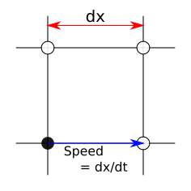
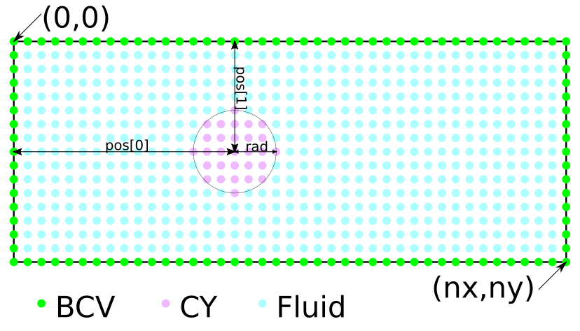
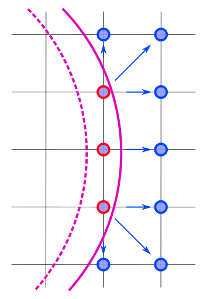
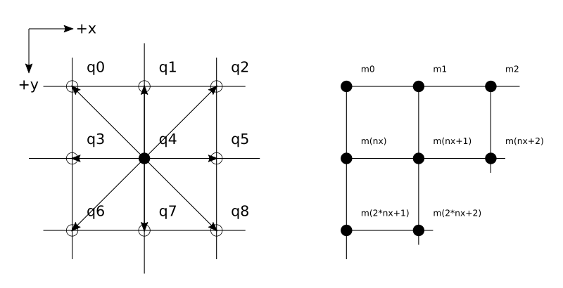

# Lattice Boltzmann Method - Cylindrical Moving Boundary

**Table of contents:**
- [What's the physics of this LBM simulation ?](#What's-the-physics-of-this-LBM-simulation-?)
- [Dependences and Build process](#Dependences-and-Build-process)
- [Usage](#Usage)

## What's the physics of this LBM simulation ?
For the simplicity of this instruction, I will not cover detail information about Lattice-Boltzmann Method here. Please checkout following articles if you needed:
- Great brief instruction by Dan Schroeder: [link](https://physics.weber.edu/schroeder/javacourse/LatticeBoltzmann.pdf)
- The Lattice Boltzmann Method: [ISBN 978-3-319-44649-3](https://link.springer.com/book/10.1007/978-3-319-44649-3)

This is a log file produced by this simulator during an experiment, and many useful parameters are recorded:
```
[Selected device]: NVIDIA GeForce MX150
[Workgroup info]
	global_size: 480/270 (total: 129600)
	local_size: 16/9 (total: 144)
	workgroups: 30/30 (total: 900)
[Kernel info]:
	CL_KERNEL_WORK_GROUP_SIZE: 8
[Parameters]: (* config value)
	<Stratage>
		1. Similarity for the Reynolds number
		2. Spectify CL for CT
	<Dimensionless>
	 *	Mach number(MA): 0.300000
		Reynolds number: 106.431585
		Grid Reynolds number: 0.131397
	<Lattice unit>
	 *	Collision frequency(CF): 0.550000
		Kinematic viscosity: 1.318182
	 *	BCV D: 0.300000 Ux: 0.100000 Uy: 0.000000
	 *	Size nx: 480 ny: 270
		Speed of sound(Csl): 0.333333
	<Conversion factors>
	 *	Length(CL): 1.000000 (m/lattice space)
		Time(CT): 0.001698 (secs/time step)
	 *	Density(CD): 1.225000kg/m^3
		Mass: 1.225000kg
		Force: 1274490.000000kg*m/s^2
		Spring constant: 1274490.000000kg/s^2
		Damping constant: 1249.500000kg/s
	<SI unit>
		Kinematic viscosity: 448.181818m^2/s
		Size width: 480.000000m height: 270.000000m
	 *	Speed of sound(CS): 340.000000m/s
		BCV D: 0.367500kg/m^3 Ux: 102.000000m/s Uy: 0.000000m/s
	<Dirty tricks>
	 *	REFUEL_RTO: 0.500000
	 *	EAT_RTO: 0.050000
	<Objects>
		[spring] [damping] [mass] [Nau_freq] [Nau_cyc]
		0: 127449.000000kg/s^2 0.000000kg/s 1225.000000kg 1.623380Hz 0.615999s
		1: 127449.000000kg/s^2 0.000000kg/s 1225.000000kg 1.623380Hz 0.615999s
```
**The prefix `*` indecate that this value is selected by user in a configuration file**, and the rest are calculated accordingly.
`[Selected device]`,`[Workgroup info]` and `[Kernel info]` sections describe the computing environments adapted by OpenCL program, we will discuss them later. For now we wnat to focus on `[Parameters]`, which connect this Lattice space simulation into a real-world model.

Ok, let's take a look at the most fundamental connection: units.

### Conversion factors between Lattice and SI unit

```
*	Length(CL): 1.000000 (m/lattice space)
	Time(CT): 0.001698 (secs/time step)
*	Density(CD): 1.225000kg/m^3
```

In the Lattice space (indecated with `'`), following parameters are charatized as:

1. Grid spacing(dx) = 1 L'
2. Time step(dt) = 1 T'
3. Weight per grid(dd) = 1 D'

Therefore with the defination of conversion factor `CL` ([L] = m<sup>1</sup>):

> CL = L/L'

we can easily set the Lattice length in SI unit since [CL] = m<sup>1</sup>/dx<sup>1</sup>, i.e. the length of a grid spacing in meters.

> **[Note]** With the fact that dx = 1 and dt = 1, for each iteration in simulation particles will travel for exactly 1 grid space.  
> 

Here in the `<Conversion factors>` section you can see that only `CL` and `CD` are selected, but we also need `CT` to calculate all others factors like force, Spring constant, etc. And that's how dimensionless quantity joined the table.

### Dimensionless 
According to Law of Similarity, Reynolds and Mach numbers are the same in both Lattice and SI units. That's why thay are dimensionless values. The connection between these two numbers is the typical velocity of the simulation(`U`). Usually, we choose the velocity of the unified flow surrounding the box for the calculation of Mach numbers. With this relationship, we only need to specify one of these numbers and the other will be fixed accordingly. For this simulator, Mach number can be specified in the configuration file. The definition of Mach number:

> MA = U/Cs = U'/Cs'

While `Cs` is the speed of sound. With the conversion factor of speed equal to:

> CU = CL/CT = U/U' = Cs/Cs'

we get:

> CL/CT = Cs/Cs' = Cs*MA/U'

Organized we have

> CT = CL\*U'/(Cs*MA)

Now we know that if `CL`,`U'`,`Cs` and `MA` are fixed, we get `CT`. Let's go back and take a look at that log file again.

```
	<Dimensionless>
	 *	Mach number(MA): 0.300000
	<Lattice unit>
	 *	BCV D: 0.300000 Ux: 0.100000 Uy: 0.000000
	<Conversion factors>
	 *	Length(CL): 1.000000 (m/lattice space)
	<SI unit>
	 *	Speed of sound(CS): 340.000000m/s
```
`BCV` describe the macro-scopic dynamics of the flow surrounding the box, where typical velocity in Latttice space `U'` came in. We will discuss them later. With these parameters being defined, we can calculate the rest conversion factors without trouble.

Let's take a look at those factors we just calculated.
```
	<Dimensionless>
		Reynolds number: 106.431585
	<Conversion factors>
		Time(CT): 0.001698 (secs/time step)
	 *	Density(CD): 1.225000kg/m^3
		BCV D: 0.367500kg/m^3 Ux: 102.000000m/s Uy: 0.000000m/s
	<SI unit>
		Size width: 480.000000m height: 270.000000m
	 *	Speed of sound(CS): 340.000000m/s
``` 
Following facts can be known with these results:

- With the density is around 1.225kg and the speed of sound is 340 m/s, we know that this fluid probably is Air in room temperature.
- With Reynolds number equal 106.431 we know that it is a laminar flow since typical borderline between laminar and turbulence is 2300. Which also match the Mach number we defined, that the flow is much slower then the speed of sound and there should be no heavy compression during the simulation.
- The simulation took place in a 480x270 meters area and the fluid speed in x-axis is 102 m/s, which means it take about 4.7 seconds to travel from the left side edge to the right side edge. Divide by the time conversion factor `CT`, we know it took 2771 steps of iterations for this trip.

> [Warning] Keep in mind that I use the diameter of the cylinder for typical length in the calculation of Reynolds number. If multiple cylinders are included, maybe apply the mean distance between them for typical length will produce more accurate Reynolds number.

### Inspecting the Simulation model
It is time to discuss about those cylinders being placed in the simulation. This is what a single cylinder looks like:



In a 2D simulation that manipulate 3D calculation of a cylinder, we consider this cylinder is infinite long and the simulation depth is also infinite. All calculation relate to the geometric should consider to be unified by depth, like force, pressure, etc. Each cylinder is consider to be a rigid body and is connected with 2 springs and 2 dampers, which simplified the calculation of the mechanical of materials.


This modeling will ignore the rotation of the cylinder, but it is easy to add another pair of spring and damper for angular movement in future. The interaction between the border of the cyliner and fluid around it is a simple bouncing-back model. These Two images indecate the direction after a bouncing was happened.


The rule of bouncing look like this:


You may ask: why the particles didn't bouncing like a billiard? This relate to the assumption of non-slip condition in fluid dynamics. In this condition, the fluid located at the surface of a solid object is consider to have zero relative velocity with the object. With the rule that bounce the particle right back to where its came from, the fluid faster then the object will be slow down and transfer the momentum to the object, and this is how we collect the shear stress from the fluid to the cylibder surface.

### Dirty tricks
Ok, we have finished those processes which are well tested and already been written into the papers. Now I have to show some sloppy and messy tricks I did to make things work, and it all caused by moving boundary.


When the cylinder is moving it will release nods that was covered in one side, and eat new nodes in another side. To those being release and need to be refuel, I will call it **refuel** nodes. As for those being eaten, I simply called it **eat** nodes. 

The image below describe what will happened in `refuel` nodes. It may not cause serious problem if the step is small enough and the viscosity is low, but there will be a peak of force when ever the cylinder move across a node. This is cause by the fact that in the moment of that crossing happen, only one side of the cylinder have make contact with fluid, and with the force calculation done by bouncing back algorithm the incremental total force will be highly unbalanced. We defined a ratino named `REFUEL_RTO` and fill the empty slots base on this ratio multiply the density distributions in surrounding nodes. 


And this is for `eat` nodes. If we ignore these nodes, the conservation of mass will be breaked (since what being eaten will be gone for ever) and the accuracy will drop significantly for a fluid with high viscosity. The density distributions in these eaten nodes will be pushed to surrounding nodes, after multiplied by a ration we defined named `EAT_RTO`.



What make these trick 

## Dependences and Build process
### C binaries
All C programs are written in `C99` standard, therefore no extra libs needed. However, since some of the environment setups would be nasty for `clang` when you are compiling OpenCL kernel program, I will recommend you to use `glibc` instead. As for the The OpenCL driver, it really dependent on the platform you have. You should check your OS instruction manual for which OpenCL driver packages you need to install. In Archlinux they are:

**Runtime**
- Intel GPU: `intel-compute-runtime`
- Intel CPU: `intel-opencl-runtime<sup>AUR</sup>`
- Nvidia GPU: `opencl-nvidia`
- AMD GPU: `opencl-mesa`
- AND CPU: Not supported anymore.(?)

**Development**
- ICD loader: `ocl-icd`
- Headers: `opencl-headers`

**Tools**
- `clinfo`: good for monitoring all possible platform properties of the system.

You can build and install the binaries with: 
```shell
$> cd LBM_CYMB/src
$> make
$> make install
```
`make install` will copy all binaries and `.cl` source file into `LBM_CYMB/bin`. Clean all binaries with `make clean` if you want a fresh make.

Be advice that the Opencl target version need to be defined in you host program as 
```C
#define CL_TARGET_OPENCL_VERSION 300
```
while `300` stands for the version `3.0.0`. Also the atomic function support for 64-bits integer is required by the force calculation in `simulate_ocl.cl`, you will need to check if the device extension of `cl_khr_int64_atomics` is available for your desire platform.

### Scripts
These dependences are only used by shell script.
- `time`: Linux built-in one, GNU version also works.
- `ffmpeg`: used by `video_maker`, pack .png images into .mp4 video.
- `gnuplot`: Used by `plot.p` for visualize data.

## Usage
Following steps can be altered by your own needs, feel free to play around with it.

### Choose a Resolution
To decide a good resolution for the simulation, you should consider with:
1. **The fluid phenomenon you are studying at.** 

	The higher the resolution is, the more accurate simulation you get. However there dose not have a good calculation to tell you what resolution is enough for you, the only approach is running a benchmark.

2. **The device you are using.**

	All devices will have their own `preferred work group size multiple` affected by the number of compute units and the size of cache. Check the value with `clinfo`. Most of the case, Intel CPU will go for `128` multiple, while GPU will go for `32` multiple. A simple approach is following the screen resolution, since it is how GPU is designed for. However it may not always be the best one for sure.

### Make an experiment setup
Inside an experiment setup directory we have:
```
example/
├── a.bc
├── a.nd
├── a.pd
├── data
│   ├── 0.mp4
│   ├── 1.mp4
│   └── 2.mp4
├── debug
├── default.conf
├── log
└── plot.p
```

To perform an experiment, you will need to tweak these files:
|Name|Description|
|-|-|
|a.bc|Boundary condition file|
|a.nd|Number Density file|
|a.pd|Platform/Device file|
|default.conf|Main configuration file|

And following files are used to collect and analyze data.
|Name|Description|
|-|-|
|debug|Used to collect desire parameters|
|data|Result videos or ND files|
|log|Running conditions and status|
|plot.p|gnuplot script|


#### ND (Number Density) file
Number density matrix represent particle densities in different velocities and positions. For an D2Q9 ND file with 480x270 in size, is formatted as
```
480 270 9
[m0q0] [m0q1] [m0q2] ...
[m1q0] [m1q1] [m1q2] ...
[m2q0] [m2q1] [m2q2] ...
...
```


Use `nd_gen` to make an initial ND file with following options:
```
Usage: nd_gen [OPTION]
Otions:
	-x #, Numer of column
	-y #, Number of row
	-d #, Density (Default: 0.3)
	-i #, Ux (Default: 0.12)
	-j #, Uy (Default: 0)
	-h , Print this help page
Example:
	nd_gen -x 100 -y 30 -d 0.3 -i 0.1 -j 0 > exp_sets/[EXP_NAME]

```  

#### BC (Boundary Condition) file
Two classes are included in boundary conditions:
1. BCV: Unified fluid that surround the simulation area.
2. CY: Cylinder object.

For example:
```
bc_no 2
bc_nq 2
BCV {
	dnt 1
	ux 0.0
	uy 0.0
}
CY {
	spring 0.1
	damp 0
	mass 1000
	rad 20
	force 0 0
	acc 0 0
	vel 0 0
	dsp 10 0
	pos 250 70
}
CY {
	spring 0.1
	damp 0
	mass 1000
	rad 20
	force 0 0
	acc 0 0
	vel 0 0
	dsp 10 0
	pos 250 150
}
```
|Parameter|Description|
|-|-|
|bc_no|Number of objects|
|bc_nq|Kinematic dimension of objects, usually 2 in 2D simulation.|
|dnt|Density|
|ux|Macro velocity in x axis|
|uy|Macro velocity in y axis|
|spring|Spring constant of the cylinder, in lattice unit|
|force|Initial value of applied force of the cylinder, in lattice unit|
|damp|Damping constant of the cylinder, in lattice unit|
|mass|Mass of the cylinder, in lattice unit|
|rad|Radius of the cylinder, in lattice unit|
|force|Initial value of applied force of the cylinder, in lattice unit|
|acc|Initial value of applied force of the cylinder, in lattice unit|
|vel|Initial value of velocities of the cylinder, in lattice unit|
|dsp|Initial value of displacements of the cylinder, in lattice unit|
|pos|Initial value of positions of the cylinder, in lattice unit|

#### PD (Platform/Device) file

- **Platform & Device**
	
	A platform is an specific OpenCL implementation, e.g. Intel, AMD or Nvida CUDA. A device is the actual processor that perform the calculation, like `Intel(R) Core(TM) i7-8565U CPU @ 1.80GHz`, `NVIDIA GeForce MX150`.

- **Work-group & Work-item** 

	A work-group is processed by a single compute unit in the device. For a CPU device it prefer a larger work-group size, while a GPU works opposite. The amount of work-item in a work-group has its limitation, check *Max work group size* for the value. For multi-dimension work-group, the total amount of work-item cannot exceed *Max work group size* too, and the work-item in each dimension will have their own limitation. Check *Max work item sizes* for the value.

Use the script `speed_test` to choose the best environment setup. If the chosen work-group exceed the max allowed work-group size for the device, the result will not be printed. Example: 

```shell
$> clinfo -l
Platform #0: Intel(R) OpenCL HD Graphics
 `-- Device #0: Intel(R) UHD Graphics 620 [0x3ea0]
Platform #1: Intel(R) OpenCL
 `-- Device #0: Intel(R) Core(TM) i7-8565U CPU @ 1.80GHz
Platform #2: NVIDIA CUDA
 `-- Device #0: NVIDIA GeForce MX150
$> ./speed_test exp_sets/example
#Syntax: pdFileName[platform device localSize1 localSize2] realTime(secs)
#
Working on...completed!
p2d0_120.pd[2/0/16/9]                             	7.90
p0d0_120.pd[0/0/16/9]                             	8.11
p1d0_24.pd[1/0/80/45]                             	8.28
p1d0_40.pd[1/0/48/27]                             	8.43
p1d0_60.pd[1/0/32/18]                             	8.52
p1d0_120.pd[1/0/16/9]                             	8.55
p1d0_20.pd[1/0/96/54]                             	8.60
p1d0_30.pd[1/0/64/36]                             	8.70
p2d0_60.pd[2/0/32/18]                             	8.75
```
You can see that Nvidia GPU with 16x9 work-group size is the fastest one. Write the result to your experiment setup with:
```
$> cp pd_auto/p2d0_120.pd exp_sets/example/a.pd
``` 

#### .conf file
Following parameters are included in a configuration file:
|Parameter|Description|Default|
|-|-|-|
|LOOP|Iteration of `SKP`.|1|
|SKP|Iteration of fluid propagate by time step.|1|
|CF|Collision frequency in Lattice unit|1|
|CS|Speed of sound in SI unit.|340|
|CL|Dimensional value of length|1|
|CD|Dimensional value of Density|1|
|MA|Mach number(Dimensionless)|0.1|
|IS_MP4|Make mp4 videos or not.|0|
|IS_SAVE_DATA|Save final ND matrix or not.|0|
|IS_FILE_OUTPUT|Save ND matrix for every loops or not.|0|
|ND_FILE|ND filename|NULL|
|BC_FILE|BC filename|NULL|
|PD_FILE|PD filename|NULL|
|OUTPUT_DIR|Output filename|NULL|
|PROGRAM_FILE|OpenCL source filename|NULL|
|REFUEL_RTO|Refuel ratio|0.8|
|EAT_RTO|Eat ratio|0.01|
|LOG_FILE|Log filename|NULL|
|DEBUG_FILE|Debug filename|NULL|
|IS_LOG_PRINT|Print log to stdout or not.|1|
|IS_PROGRESS_PRINT|Print progress or not|1|
|PL_MAX_D|Maximum density value for the jetcolormap ploting|0.5|
|PL_MAX_UX|Maximum x velocity value for the jetcolormap ploting|0.1|
|PL_MAX_DUY|Maximum y velocity value for the jetcolormap ploting|0.1|

> [Warning] The `SKP` vaule should not exceed 10. This is because I need to use atomic function to collect the force applied on the objects from different workgroups RAM, and the value cannot exceed the capability of containing of a `long` variable.

### Perform an experiment
Run `simulator` with desire experiment setup:
```shell
$> ./simulator exp_sets/1920x1080
``` 
If multiple experiments are going to be launched at once, use `schedule` plus a plain text list file of experiment setups directory name, like:
```shell
$> cat exp_grp1
exp_sets/480x270_skp10
exp_sets/480x270_skp20
exp_sets/480x270_skp30
exp_sets/480x270_skp40
exp_sets/480x270_skp50
```
And launch is with:
```shell
$> ./schedule exp_grp1
```


