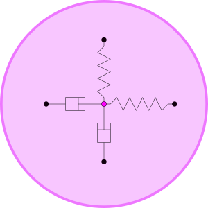
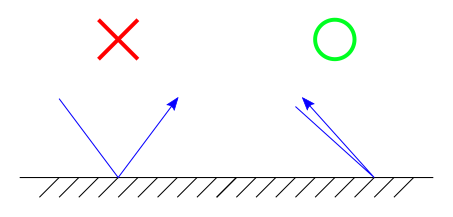
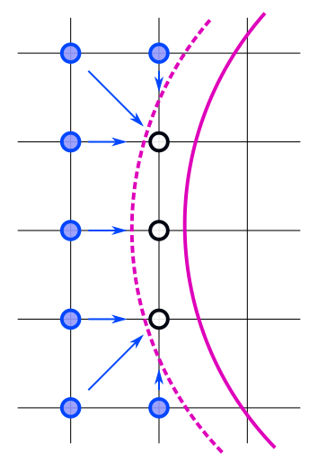

## What's the physics of this LBM simulation ?
For the simplicity of this instruction, I will not cover detail information about Lattice-Boltzmann Method here. Please checkout following articles if you needed:
- Great brief instruction by Dan Schroeder: [link](https://physics.weber.edu/schroeder/javacourse/LatticeBoltzmann.pdf)
- The Lattice Boltzmann Method: [ISBN 978-3-319-44649-3](https://link.springer.com/book/10.1007/978-3-319-44649-3)

This is a log file produced by this simulator during an experiment, and many useful parameters are recorded:
```
[Selected device]: NVIDIA GeForce MX150
[Workgroup info]
	global_size: 480/270 (total: 129600)
	local_size: 16/9 (total: 144)
	workgroups: 30/30 (total: 900)
[Kernel info]:
	CL_KERNEL_WORK_GROUP_SIZE: 8
[Parameters]: (* config value)
	<Stratage>
		1. Similarity for the Reynolds number
		2. Spectify CL for CT
	<Dimensionless>
	 *	Mach number(MA): 0.300000
		Reynolds number: 106.431585
		Grid Reynolds number: 0.131397
	<Lattice unit>
	 *	Collision frequency(CF): 0.550000
		Kinematic viscosity: 1.318182
	 *	BCV D: 0.300000 Ux: 0.100000 Uy: 0.000000
	 *	Size nx: 480 ny: 270
		Speed of sound(Csl): 0.333333
	<Conversion factors>
	 *	Length(CL): 1.000000 (m/lattice space)
		Time(CT): 0.001698 (secs/time step)
	 *	Density(CD): 1.225000kg/m^3
		Mass: 1.225000kg
		Force: 1274490.000000kg*m/s^2
		Spring constant: 1274490.000000kg/s^2
		Damping constant: 1249.500000kg/s
	<SI unit>
		Kinematic viscosity: 448.181818m^2/s
		Size width: 480.000000m height: 270.000000m
	 *	Speed of sound(CS): 340.000000m/s
		BCV D: 0.367500kg/m^3 Ux: 102.000000m/s Uy: 0.000000m/s
	<Dirty tricks>
	 *	REFUEL_RTO: 0.500000
	 *	EAT_RTO: 0.050000
	<Objects>
		[spring] [damping] [mass] [Nau_freq] [Nau_cyc]
		0: 127449.000000kg/s^2 0.000000kg/s 1225.000000kg 1.623380Hz 0.615999s
		1: 127449.000000kg/s^2 0.000000kg/s 1225.000000kg 1.623380Hz 0.615999s
```
**The prefix `*` indecate that this value is selected by user in a configuration file**, and the rest are calculated accordingly.
`[Selected device]`,`[Workgroup info]` and `[Kernel info]` sections describe the computing environments adapted by OpenCL program, we will discuss them later. For now we wnat to focus on `[Parameters]`, which connect this Lattice space simulation into a real-world model.

Ok, let's take a look at the most fundamental connection: units.

### Conversion factors between Lattice and SI unit

```
*	Length(CL): 1.000000 (m/lattice space)
	Time(CT): 0.001698 (secs/time step)
*	Density(CD): 1.225000kg/m^3
```

In the Lattice space (indecated with `'`), following parameters are charatized as:

1. Grid spacing(dx) = 1 L'
2. Time step(dt) = 1 T'
3. Weight per grid(dd) = 1 D'

Therefore with the defination of conversion factor `CL` ([L] = m<sup>1</sup>):

> CL = L/L'

we can easily set the Lattice length in SI unit since [CL] = m<sup>1</sup>/dx<sup>1</sup>, i.e. the length of a grid spacing in meters.

> **[Note]** With the fact that dx = 1 and dt = 1, for each iteration in simulation particles will travel for exactly 1 grid space.  
> 

Here in the `<Conversion factors>` section you can see that only `CL` and `CD` are selected, but we also need `CT` to calculate all others factors like force, Spring constant, etc. And that's how dimensionless quantity joined the table.

### Dimensionless 
According to Law of Similarity, Reynolds and Mach numbers are the same in both Lattice and SI units. That's why thay are dimensionless values. The connection between these two numbers is the typical velocity of the simulation(`U`). Usually, we choose the velocity of the unified flow surrounding the box for the calculation of Mach numbers. With this relationship, we only need to specify one of these numbers and the other will be fixed accordingly. For this simulator, Mach number can be specified in the configuration file. The definition of Mach number:

> MA = U/Cs = U'/Cs'

While `Cs` is the speed of sound. With the conversion factor of speed equal to:

> CU = CL/CT = U/U' = Cs/Cs'

we get:

> CL/CT = Cs/Cs' = Cs*MA/U'

Organized we have

> CT = CL\*U'/(Cs*MA)

Now we know that if `CL`,`U'`,`Cs` and `MA` are fixed, we get `CT`. Let's go back and take a look at that log file again.

```
	<Dimensionless>
	 *	Mach number(MA): 0.300000
	<Lattice unit>
	 *	BCV D: 0.300000 Ux: 0.100000 Uy: 0.000000
	<Conversion factors>
	 *	Length(CL): 1.000000 (m/lattice space)
	<SI unit>
	 *	Speed of sound(CS): 340.000000m/s
```
`BCV` describe the macro-scopic dynamics of the flow surrounding the box, where typical velocity in Latttice space `U'` came in. We will discuss them later. With these parameters being defined, we can calculate the rest conversion factors without trouble.

Let's take a look at those factors we just calculated.
```
	<Dimensionless>
		Reynolds number: 106.431585
	<Conversion factors>
		Time(CT): 0.001698 (secs/time step)
	 *	Density(CD): 1.225000kg/m^3
		BCV D: 0.367500kg/m^3 Ux: 102.000000m/s Uy: 0.000000m/s
	<SI unit>
		Size width: 480.000000m height: 270.000000m
	 *	Speed of sound(CS): 340.000000m/s
``` 
Following facts can be known with these results:

- With the density is around 1.225kg and the speed of sound is 340 m/s, we know that this fluid probably is Air in room temperature.
- With Reynolds number equal 106.431 we know that it is a laminar flow since typical borderline between laminar and turbulence is 2300. Which also match the Mach number we defined, that the flow is much slower then the speed of sound and there should be no heavy compression during the simulation.
- The simulation took place in a 480x270 meters area and the fluid speed in x-axis is 102 m/s, which means it take about 4.7 seconds to travel from the left side edge to the right side edge. Divide by the time conversion factor `CT`, we know it took 2771 steps of iterations for this trip.

> [Warning] Keep in mind that I use the diameter of the cylinder for typical length in the calculation of Reynolds number. If multiple cylinders are included, maybe apply the mean distance between them for typical length will produce more accurate Reynolds number.

### Inspecting the Simulation model
It is time to discuss about those cylinders being placed in the simulation. This is what a single cylinder looks like:


In a 2D simulation that manipulate 3D calculation of a cylinder, we consider this cylinder is infinite long and the simulation depth is also infinite. All calculation relate to the geometric should consider to be unified by depth, like force, pressure, etc. Each cylinder is consider to be a rigid body and is connected with 2 springs and 2 dampers, which simplified the calculation of the mechanical of materials.



This modeling will ignore the rotation of the cylinder, but it is easy to add another pair of spring and damper for angular movement in future. The interaction between the border of the cyliner and fluid around it is a simple bouncing-back model. These Two images indecate the direction after a bouncing was happened.


The rule of bouncing look like this:



You may ask: why the particles didn't bouncing like a billiard? This relate to the assumption of non-slip condition in fluid dynamics. In this condition, the fluid located at the surface of a solid object is consider to have zero relative velocity with the object. With the rule that bounce the particle right back to where its came from, the fluid faster then the object will be slow down and transfer the momentum to the object, and this is how we collect the shear stress from the fluid to the cylibder surface.

### Dirty tricks
Ok, we have finished those processes which are well tested and already been written into the papers. Now I have to show some sloppy and messy tricks I did to make things work, and it all caused by moving boundary.


When the cylinder is moving it will release nods that was covered in one side, and eat new nodes in another side. To those being release and need to be refuel, I will call it **refuel** nodes. As for those being eaten, I simply called it **eat** nodes. 



This image describe what will happened in `refuel` nodes. If we ignore these nodes and do nothing, it may not cause serious problem if the step is small enough and the viscosity is low, but there will be a peak of noise in applied force when ever the cylinder move across a node. This is cause by the fact that in the moment of that crossing happen, only one side of the cylinder have make contact with fluid, the other side will have a vacancy zone. With the force calculation is done by bouncing-back algorithm, the incremental total applied force will be highly unbalanced. To maintain the continuity of fluid , those particles which should advect into the empty slots between the time steps need to be refuel manually. We defined a ratio named `REFUEL_RTO`, and fill the empty slots with the density distributions in surrounding nodes multiplied with this ratio. 


And this is for `eat` nodes. If we ignore these nodes, the conservation of mass will be breaked (since what being eaten will be gone for ever) and the accuracy will drop significantly for a fluid with high viscosity. The density distributions in these eaten nodes will be pushed to surrounding nodes, after multiplied by a ration we defined named `EAT_RTO`.

So, what make these tricks dirty? The reason is simple: we don't know how to choose the values properly before benchmarking. If the result shows that applied force is smooth and no shock wave apeared, then the values can be used.

### That's all! For now.
The simulation is faaaaar from perfect. Many issuses need to be solved and many details can be improved. What we have now is a simulation that can import some parameters and output a result, thats' all. Following issueses are worth studying in my opinion:
- Replace BGKW with multiple relaxation time for collision operator.
- Remove dirty tricks and use interpolating bouncing-back algoritm for moving boundary.
- Calculate applied force with the calculation of surrounding pressure and shear stress with macroscopic fluid mechanics.